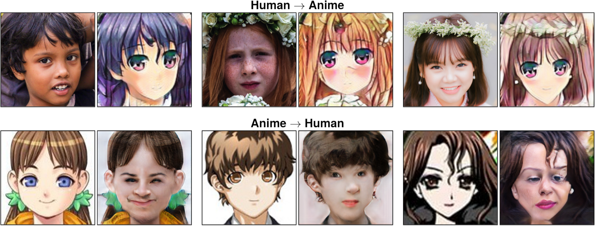

# CycleGAN for Human to Anime Face Generation

<p align="left">
    
</p>
    
### Overview
This repository contains a PyTorch reimplementation of [CycleGAN](https://arxiv.org/abs/1703.10593), and was used to transform human faces into anime faces.

### Installation

#### Clone and install

With pip:
```bash
$ git clone https://github.com/charlesoblack/cyclegan
$ cd cyclegan/
$ pip3 install -r requirements.txt
```

With conda:
```bash
$ git clone https://github.com/charlesoblack/cyclegan
$ cd cyclegan/
$ conda env create -f environment.yml
$ conda activate cyclegan
```

### Dataset

The datasets used by this project consisted of human faces and anime faces. The human faces come from the [Real and Fake Face Detection dataset](https://www.kaggle.com/ciplab/real-and-fake-face-detection)(only the real faces were used). The anime faces were compiled by Mckinsey666 and can be found [here](https://github.com/bchao1/Anime-Face-Dataset).

#### Setup data directory

The dataset directory should be structured as follows:

    ├── datasets                   
    |   ├── <dataset_name>         # i.e. human2anime
    |   |   ├── train              # Training
    |   |   |   ├── A              # Contains domain A images (i.e. human faces)
    |   |   |   └── B              # Contains domain B images (i.e. anime faces)
    |   |   └── test               # Testing
    |   |   |   ├── A              # Contains domain A images (i.e. human faces)
    |   |   |   └── B              # Contains domain B images (i.e. anime faces)

### Train Example

```bash
$ cd src/
$ python3 train.py --dataset human2anime --name experiment1
```

#### Loading pre-trained weights or resuming training

If you want to load pre-trained weights or resume from a checkpoint, simply add the epoch to resume from:

```bash
# Example: human2anime dataset, experiment1 for epoch 100
$ python3 train.py --dataset human2anime --name experiment1 --starting-epoch 100
```

### Test Example

```bash
$ cd src/
$ python3 test.py --dataset human2anime --name experiment1
```
